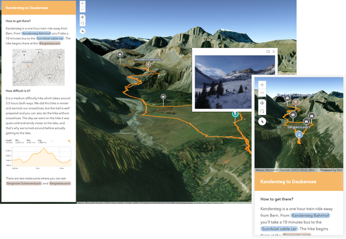

## Visualize your hiking trail with [ArcGIS API for JavaScript](https://developers.arcgis.com/javascript/)

This is a little app to visualize my hiking trails and display images from my hikes. This year I decided to go hiking way more and I want to document all this process by making small visualizations of these hikes, just like this one:

[](hike-visualization.netlify.app)

In this tutorial I'll show you the main steps in building this app, so that you can also build your own. This is what I'll cover:

1. display the hiking data on a 3D map and show an elevation profile graphic
2. display images from the hike on the map

Before we get started, to run this app, you'll need to have `git`, `node` and `npm` installed on your machine. You'll also need a Github account.

```bash
git clone https://github.com/RalucaNicola/hike-visualization.git
cd hike-visualization
npm install
// start development server
npm run start
// build production version
npm run build
```

In the end I deployed the app on Netlify and it was such a smooth process that I highly recommend it. Here is a [tutorial](https://www.netlify.com/blog/2016/09/29/a-step-by-step-guide-deploying-on-netlify/) on how to do this.

### Display the hiking data and show an elevation profile

For this step we'll use an external library called [togeojson](https://github.com/tmcw/togeojson).
I have a Fitbit Versa and I can only export the tracking data as a .tcx file. This is why in this repository I read the data as .tcx, but you can change the code to read .gpx files.

```js
import { tcx } from "@tmcw/togeojson";

request("./assets/data/hike_01_01_2020.tcx", {
  responseType: "xml"
}).then(function(response){
  const data = tcx(response.data) ;
  const geometry = new Polyline({
    paths: data.features[0].geometry.coordinates,
    spatialReference: {
      wkid: 4326
    }
  });

  const graphic = new Graphic({
    geometry: geometry
  });
  graphicsLayer.add(graphic);

});
```

If your tracking data comes in a gpx format, just replace the tcx import with gpx:

```js
import { gpx } from "@tmcw/togeojson";
```

I didn't add any symbol for the graphic, because in the next step I'll add the elevation profile and this will add a default line symbol to the graphic:

```js

new ElevationProfile({
  view: view,
  container: "profile",
  // this is the hiking trail graphic
  input: graphic,
  // sample elevation from the ground
  profiles: [{
    type: "ground",
    color: "orange"
  }],
  visibleElements: {
    legend: false,
    sketchButton: false,
    selectButton: false
  }
});
```

The [ElevationProfile](https://developers.arcgis.com/javascript/latest/api-reference/esri-widgets-ElevationProfile.html) needs a view and a container to be displayed in. The rest of the properties are optional. I am setting the [input graphic](https://developers.arcgis.com/javascript/latest/api-reference/esri-widgets-ElevationProfile.html#input) because I want to display it only for the hiking trail graphic. You could leave that property empty and then the user could choose a path in the map using the select button or draw a line using the sketch button. However, we are setting those buttons to be invisible because we don't need them.

Even though the line has z values, it didn't align very well with the ground so I prefered to render it draped on the ground and sample the elevation values from the ground ([Esri's world elevation service](https://www.arcgis.com/home/item.html?id=7029fb60158543ad845c7e1527af11e4) in this case). So, I have a single [profile line](https://developers.arcgis.com/javascript/latest/api-reference/esri-widgets-ElevationProfile.html#profiles) and that will be the ground.

Small warning at this point: if your hiking trail data has lines with more than one path, this is currently not supported by the elevation profile.

### Display images from the hike on the map

In case your images are geotagged (if you enable location on your camera), then you can just upload them to ArcGIS Online as a zip file and a point feature layer with attachments will be created. You can read more about it in Bern's blogpost: https://www.esri.com/arcgis-blog/products/arcgis-online/mapping/add-geotagged-photos-map/.

I didn't have the location enabled, so I manually created a point feature layer in ArcGIS Online and I uploaded the photo corresponding to each point. I added like this 4 points for image.

By default, you'll get the attachment as a link and this is not very convenient. Using Arcade, you can display the image in the popup.

You'll basically need to get the id of the attachment and the id of the feature to rebuild the link of the image itself:

```js
const popupExpression = `
  var urlPart1 = "https://services2.arcgis.com/cFEFS0EWrhfDeVw9/arcgis/rest/services/Hiking_POI/FeatureServer/0/"
  var objectID = $feature.OBJECTID
  var urlPart2 = "/attachments/"
  var attachID = 0;
  if (Count(Attachments($feature)) > 0) {
    attachID = (First(Attachments($feature))).id
  }
  return urlPart1 + objectID + urlPart2 + attachID
`;

const picturesLayer = new FeatureLayer({
  url: "https://services2.arcgis.com/cFEFS0EWrhfDeVw9/arcgis/rest/services/Hiking_POI/FeatureServer",
  popupTemplate: {
    expressionInfos: [{
      name: "image",
      expression: popupExpression
    }],
    content: ""
  }
});
```

And this was it, let me know if you build your own visualization of your hiking trail, I'd love to see it.

